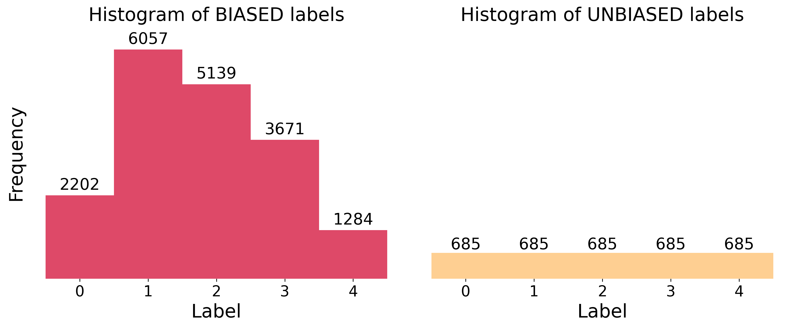
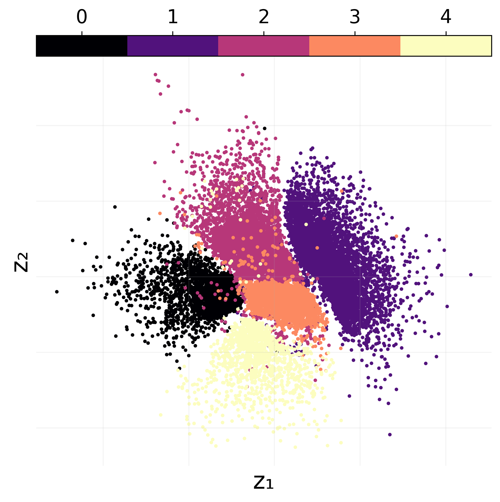
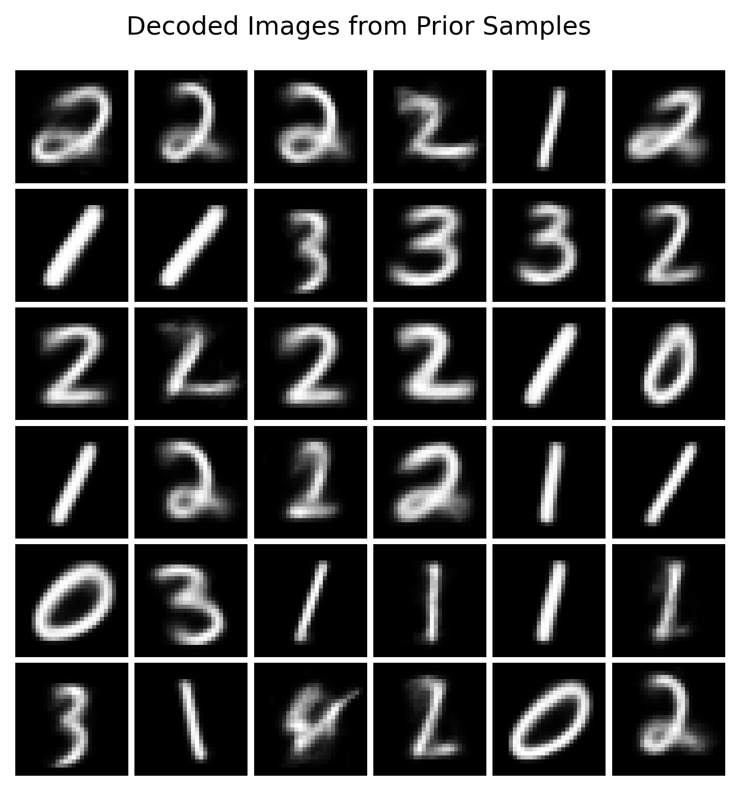
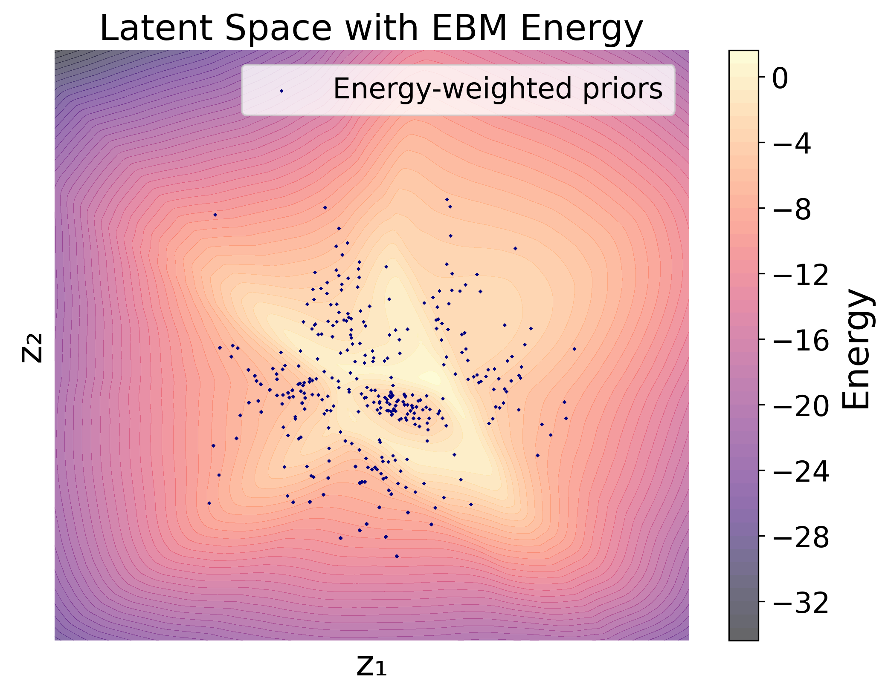
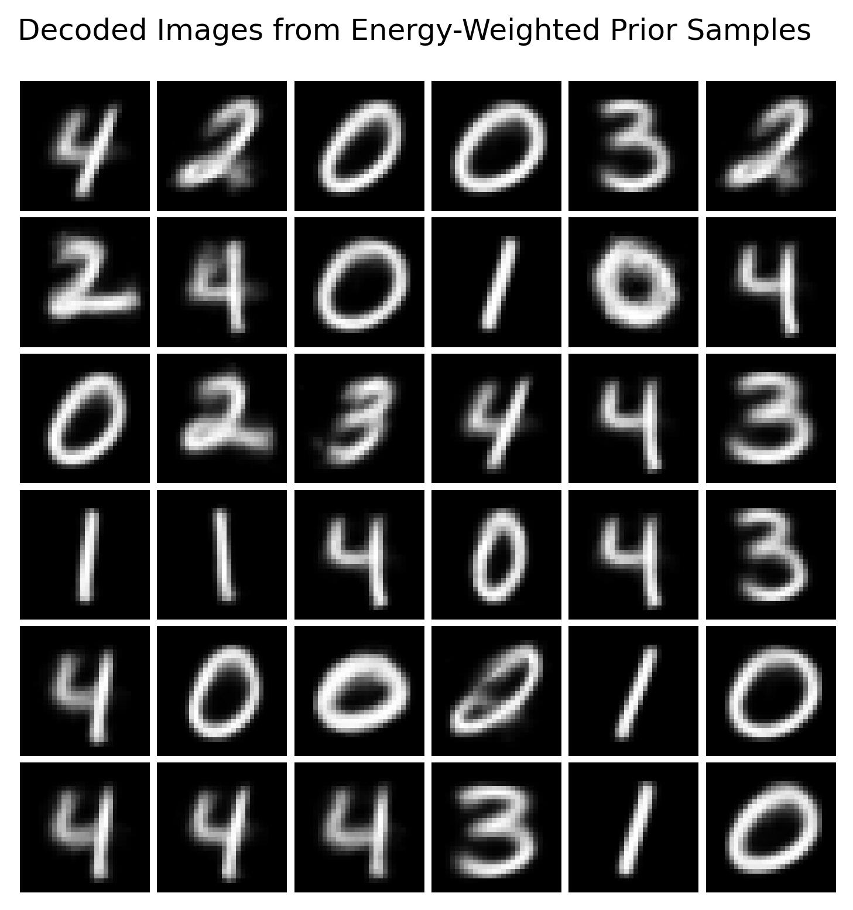
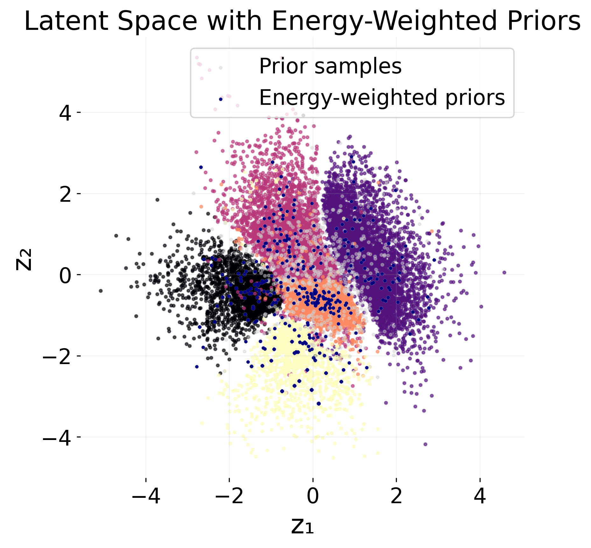

# HackathonEBM

  

In MIWAE_Pytorch_exercises_demo_ProbAI, a base model is implemented and trained on MNAR Data. We will modify this model with an Energy-Based Model (EBM) to handle the MNAR data more effectively.

  
  

# Objective:
  

 ## 1)  Using a VAE in data space

- 1.1) Train a VAE on MNAR data.

The objective of this hackathon is to modify the VAE using EBM to handle MNAR data.

VAE :

$$p_{\phi}(x) = \int p_{\phi}(x|z)p(z)dz$$

where we defined :

$$p_{\phi}(x|z) = \mathcal{N}(x; \mu_{\theta}(z), \sigma_{\theta}(z))$$

$$p(z) = \mathcal{N}(z; 0, I)$$

where $\mu_{\theta}(z)$ and $\sigma_{\theta}(z)$ are neural networks.

  

As usual in the VAE setting, we will use the reparameterization trick to sample from $p_{\phi}(x|z)$:

$$x = \mu_{\theta}(z) + \sigma_{\theta}(z) \odot \epsilon$$

where $\epsilon \sim \mathcal{N}(0, I)$ and we can get access to a lower bound of the likelihood with :

  

$$L_{VAE} = E_{p_{\phi}(x|z)} \left[ \log p_{\phi}(x|z) \right] - D_{KL}(q_{\phi}(z|x) || p(z))$$

  

where $q_{\phi}(z|x)$ is the encoder of the VAE, which we can also parameterise with a neural network.

  
  

- 1.2) First idea is just to tilt the data output with an EBM. To that end, we consider an EBM of the form:

$$p_{\theta}(x) = \frac{1}{Z_{\theta}} e^{-E_{\theta}(x)}p_{\phi(x)}$$

where $E_{\theta}(x)$ is the energy function parameterised by a neural network, and $Z_{\theta}$ is the partition function that ensures normalisation.

  

We want to train this model to minimise the log-likelihood of the data under the EBM :

$$L_{EBM} = \sum_{i=1}^n \frac{1}{n} (- E_{\theta}(x_i) + \log p_{\phi}(x_i)) + \log E_{p_{\phi}(\tilde{x})} \left[ e^{-E_{\theta}(\tilde{x})} \right]$$

  

Using Jensen's inequality, we can derive a lower bound for the log-likelihood:

$$L_{EBM} \geq \sum_{i=1}^n \frac{1}{n} (- E_{\theta}(x_i) + \log p_{\phi}(x_i)) + E_{p_{\phi}(\tilde{x})} \left[ -E_{\theta}(\tilde{x}) \right]$$

  

One can obtain the gradient in $\theta$ (and make the $q_{\phi}$ disappear) as follows:

  

$$\nabla_{\theta} L_{EBM} = \sum_{i=1}^n \frac{1}{n} \left( -\nabla_{\theta} E_{\theta}(x_i)\right) + E_{p_{\phi}(\tilde{x})} \left[ -\nabla_{\theta} E_{\theta}(\tilde{x}) \right].$$

  

The first term is the gradient of the energy function evaluated at the observed data, and the second term is the gradient of the energy function evaluated at samples from the VAE.

- 1.3) Sampling from the resulting model can be done by doing importance sampling with the VAE as proposal distribution $p_{\phi}(x)$. To that end, we can sample some samples from the VAE $x_i \sim p_{\phi}(x)$ and reweight them according to the EBM:

$$\tilde{w}_i = e^{-E_{\theta}(x_i)}$$

Since the partition function $Z_{\theta}$ is unknown, we can uses self normalised importance sampling (SNIS) to obtain the weights:
$$w_i = \frac{\tilde{w}_i}{\sum_{j=1}^n w_j}$$

Then we can sample from the weighted samples $\tilde{x}_i$ according to the weights $\tilde{w}_i$.

- 1.4) Sampling from the resulting model can be done by sampling from the VAE and then use a MCMC chain to update the samples according to the EBM.

The gradient of the full log-likelihood guides the MCMC chain:

$$\nabla_{x} \log p_{\theta}(x) = -\nabla_{x} E_{\theta}(x) + \nabla_{x} \log p_{\phi}(x)$$

wwhere $p_{\phi}(x)$ can be approximated by the ELBO of the VAE.

  

$$x_{t+1} = x_t - \eta \left( -\nabla_{x} E_{\theta}(x_t) + \nabla_{x} \log p_{\phi}(x_t) \right)$$

where $\eta$ is the step size.

  
  
  
  
  

 ## 2)  Using a VAE in latent space

- 1.1) First part is the same, just train the VAE.

- 1.2) Tilt the EBM in latent space :

$$p_{\theta}(x) = \int_{z} \frac{1}{Z_{\theta}} e^{-E_{\theta}(z)}p_{\phi}(x|z)p_{}(z)\mathrm{d}z$$

where $E_{\theta}(x)$ is the energy function parameterised by a neural network, and $Z_{\theta}$ is the partition function that ensures normalisation.
The tilted prior is : $p_{\theta}(z) = \frac{e^{-E_{\theta}(z)} p(z)}{Z_{\theta}}$

We want to train this model to minimise the log-likelihood of the data :

$$
\begin{align}
\mathcal{L}_{EBM} & = \log p_{\theta}(x) \\
& = \log \int_{z} \frac{1}{Z_{\theta}} e^{-E_{\theta}(z)}p_{\phi}(x|z)p(z) \frac{q_{\psi}(z|x)}{q_{\psi}(z|x)}\mathrm{d}z \\
& = \log \mathbf{E}_{q_{\psi}(z|x)}\left[\frac{1}{Z_{\theta}}  \frac{e^{-E_{\theta}(z)}p_{\phi}(x|z)p(z)}{q_{\psi}(z|x)}\right] \\
(Jensen) & \leq \mathbf{E}_{q_{\psi}(z|x)}\left[  - E_{\theta}(z) + \log p(z) - \log q_{\psi}(z|x) + \log{p_{\phi}(x|z)}  \right] -\log\left(Z_{\theta}\right) \\
& = \mathbf{E}_{q_{\psi}(z|x)}\left[- E_{\theta}(z)+ \log p(z) \right]+ \mathbf{E}_{q_{\psi}(z|x)} \left[ - \log q_{\psi}(z|x) + \log{p_{\phi}(x|z)} \right]  -\log\left(Z_{\theta}\right) \\

\end{align}
$$
We can just replace $Z_{\theta}$ following :

$$\log(Z_{\theta}) = \int_{z} e^{-E_{\theta}(z)}p(z)\mathrm{dz} = \mathbf{E}_{p(z)}\left[ e^{-E_{\theta}(z)} \right]
$$

  
$$
\begin{align}
\mathcal{L}_{EBM} & =  \mathbf{E}_{q_{\psi}(z|x)}\left[- E_{\theta}(z)+ \log p(z) \right]+ \mathbf{E}_{q_{\psi}(z|x)} \left[ - \log q_{\psi}(z|x) + \log{p_{\phi}(x|z)} \right]  -\log\left(Z_{\theta}\right) \\
& = \mathbf{E}_{q_{\psi}(z|x)}\left[- E_{\theta}(z)+ \log p(z) \right]+ \mathbf{E}_{q_{\psi}(z|x)} \left[ - \log q_{\psi}(z|x) + \log{p_{\phi}(x|z)} \right] - \mathbb{E}_{p(\tilde{z})}\left[-E_{\theta}(\tilde{z})\right] \\
& = \mathbf{E}_{q_{\psi}(z|x)}\left[- E_{\theta}(z)\right] - \mathbb{E}_{p(\tilde{z})}\left[-E_{\theta}(\tilde{z})\right] + \ldots
\end{align}
$$

- 1.3) Sampling from the resulting model can be done by doing Self-normalized Importance Sampling resampling with the prior distribution $p(z)$ as proposal.

- 1.4) Also with MCMC.

## 3) Takeaways

Results with the EBM in data space have been unconvincing so far, better results in the latent space (see 2d-small.ipynb). The notebook is extended into 2d.ipynb, which contains additional results measuring the degree of debiasing as well as a more advanced sampling method (Langevin MCMC). Lower dimensional latent spaces appear to be more easy to work with than higher dimensional ones (see 10d-small.ipynb).

## Short walkthrough of the 2D latent EBM
We first compare the label distributions of biased and unbiased datasets to illustrate a setting of class imbalance between training and test scenarios.  

Next, we train and encode the biased data onto the 2D latent space to observe how digit classes separate under the trained VAE.

We then sample from the standard normal prior and decode those latent vectors to inspect the raw generative quality based on prior-sampled images.

Next, we fit the EBM and contour the learned EBM energy landscape over the latent plane. Using the EBM, we can adjust prior samples to have a better fit to the (limited) unbiased data.

Decoding the energy-weighted samples, we can see that the model manages to sample more images from the undersampled classes.

We overlay the original latent embeddings with both unweighted and energy-weighted prior samples to visualize how the EBM can help adjust class imbalance for generative models!  

Notebook 2d.ipynb contains additional results.

